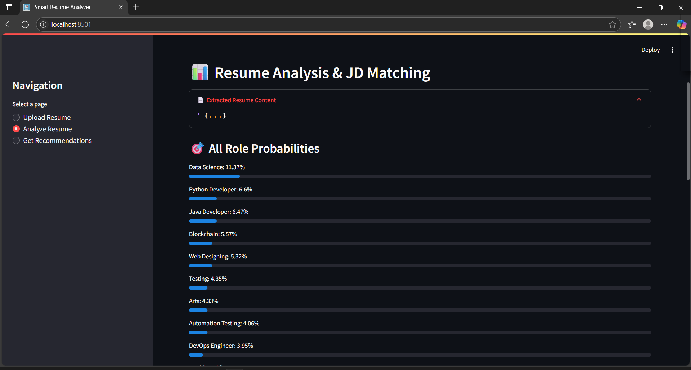
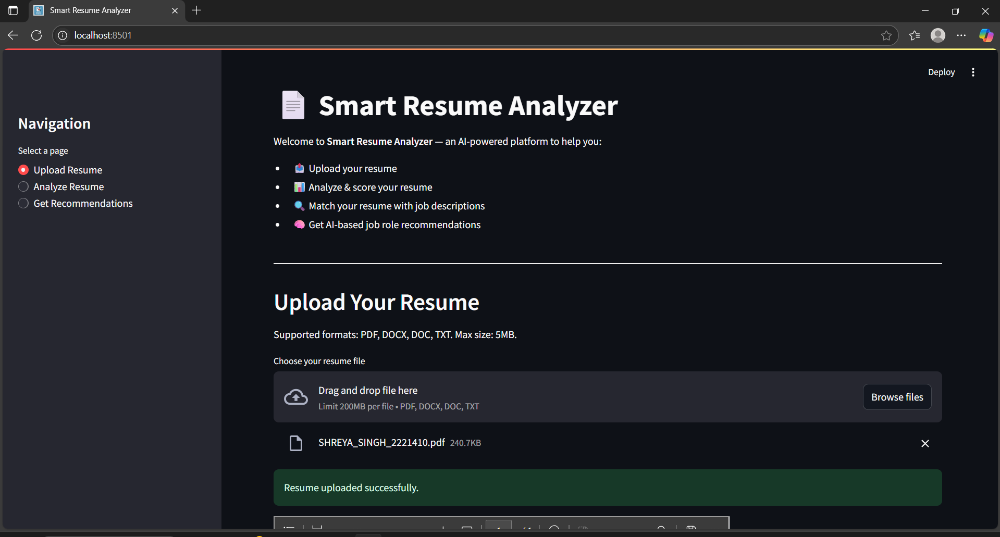
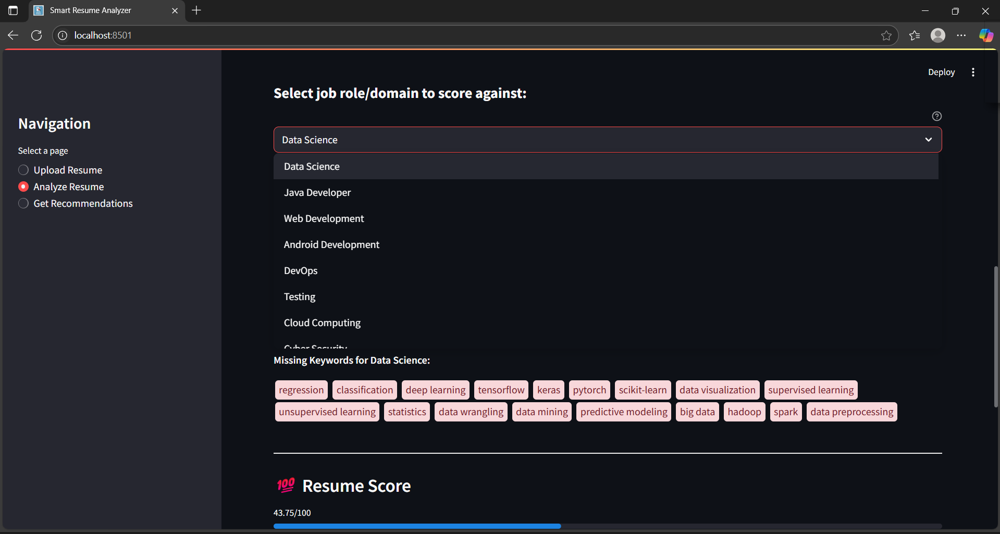
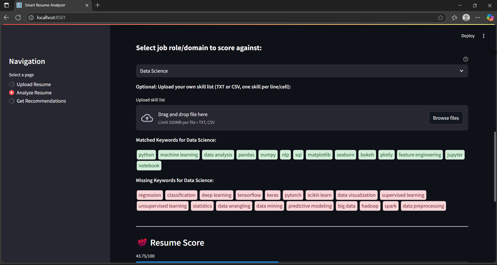
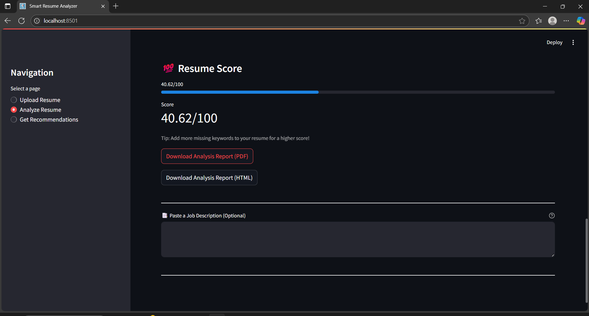
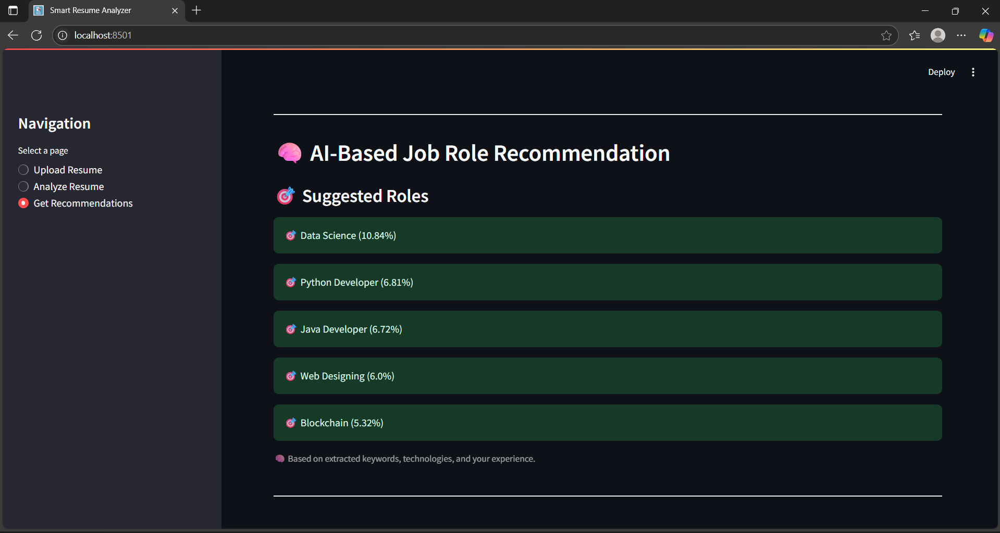

# jobfit-resume-analyzer

- Live Demo: [jobfit-resume-analyzer](https://jobfit-resume-analyzer.streamlit.app/)

As a part of CSI Internship Week 7 Assignment: Deploying Machine Learning Models with Streamlit:

`jobfit-resume-analyzer` is a robust, user-friendly web application built with Streamlit. It leverages machine learning and natural language processing to analyze resumes, score them against job roles, and provide actionable recommendations. The application is designed to help job seekers understand how well their resumes align with specific job roles and to assist recruiters in efficiently screening candidates.

## Screenshots

### Upload Resume



### Analyze Resume




### Get Recommendations


## Features
- Upload resumes in PDF, DOCX, DOC, or TXT format
- Input validation for file type, size, and content
- Extracts name, email, phone, skills, education, experience, projects, and achievements
- Skill matching supports synonyms and partial matches
- Customizable scoring: upload your own skill list (TXT/CSV)
- Resume scored against selected or custom job role
- Displays all role probabilities
- Downloadable PDF and HTML analysis reports
- Modern, accessible Streamlit UI with progress indicators and clear error messages
- Supports generic roles like Software Development Engineer (SDE), Full Stack Developer, and more

## Requirements
- Python 3.8 or higher
- All required Python packages are listed in `requirements.txt`

## Setup
1. Clone the repository
2. Install dependencies:
   ```bash
   pip install -r requirements.txt
   ```
3. Download the spaCy English model:
   ```bash
   python -m spacy download en_core_web_sm
   ```
4. Run the application:
   ```bash
   streamlit run streamlit_app/app.py
   ```

## Usage
- Access the application in your browser using the local URL
- Upload your resume (PDF, DOCX, DOC, or TXT)
- View extracted content, matched keywords, and your resume score
- Optionally upload a custom skill list for personalized scoring
- Paste a job description to see how well your resume matches
- Download a PDF or HTML report of your analysis

## Folder Structure
```text
jobfit-resume-analyzer/
├── requirements.txt          # Python dependencies
├── README.md                 # Project documentation
├── approach.md               # Project methodology and approach
├── output.txt                # Sample output from the app
├── streamlit_app/
│   ├── app.py               # Main Streamlit UI
│   ├── resume_parser.py     # Extract text, skills, and sections from resumes
│   ├── recommender.py       # Recommend job roles based on content
│   ├── score_resume.py      # Score resume using trained ML model
│   ├── jd_matcher.py        # Match resume with job description
│   ├── utils.py             # Helper functions (file handling, NLP, etc.)
│   └── config.py            # Central config (file paths, model type, etc.)
├── notebooks/
│   ├── model_training.ipynb  # Jupyter notebook for model training
│   └── embedding_analysis.ipynb # Jupyter notebook for embedding analysis
├── model/
│   ├── classifier.pkl         # Resume role classifier (ML model)
│   ├── vectorizer.pkl         # TF-IDF vectorizer
│   ├── scorer_model.pkl       # Resume score predictor (ML model)
│   └── label_encoder.pkl      # Encodes/decodes job role classes
├── data/
│   ├── skills_list.txt       # Skill dictionary
│   ├── UpdatedResumeDataSet.csv # Resume dataset for training/testing
│   └── resume_embeddings.csv # Embedding and cluster data for visualization
├── assets/
│   ├── icon.png               # App icon
│   ├── demo_resume.pdf        # Demo/sample resume for testing
│   ├── image-2.png            # Screenshot images for README
│   ├── image-3.png            # Screenshot images for README     
│   ├── image-4.png            # Screenshot images for README
│   ├── image-5.png            # Screenshot images for README
│   ├── image-6.png            # Screenshot images for README
├── folder_structure.md       # This file: folder structure documentation
├── .gitignore                # Git ignore rules
```

## Sample Output
See `output.txt` for example outputs and what to expect from the app.

## Credits
- Developed as an internship assignment
- Built with Streamlit, scikit-learn, spaCy,  NLTK, and related technologies
- Icon attribution as required